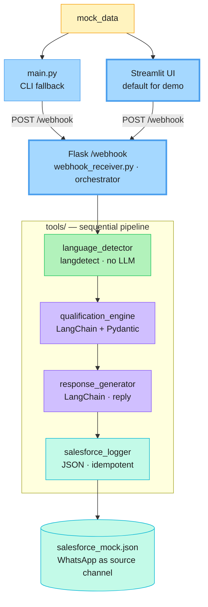

# Quinn WhatsApp LATAM — POC

A new inbound channel for Quinn (Telnyx's AI SDR): WhatsApp qualification for the
LATAM market. Built as a take-home POC for Telnyx's Growth Engineer, GTM AI role.

**The angle:** Telnyx is launching WhatsApp Business and just hired its first
Portuguese-speaking SDRs. Quinn currently has zero WhatsApp presence. This POC
dogfoods Telnyx's own product to extend Telnyx's own AI SDR — and demonstrates
the architecture in 35 minutes, end-to-end.

**Business case:** see [BUSINESS_CASE.md](BUSINESS_CASE.md) for the ROI math — Fermi estimate with three scenarios (pessimistic floor: ~$86K/year incremental ARR; conservative: ~$420K/year; post-WhatsApp-Business-GA: ~$5–19M/year), plus the asymmetric downside of NOT shipping it before GA.

---

## What it does

1. Receives a Telnyx-shaped WhatsApp `message.received` webhook
2. Detects the message language; flags Portuguese/Spanish as LATAM
3. Calls Claude Sonnet via LangChain (`ChatAnthropic` + Pydantic-typed `.with_structured_output()`) to score ICP fit and intent, decides routing
4. Calls Claude Sonnet via LangChain (`ChatAnthropic` + `ChatPromptTemplate`) to generate Quinn's reply in English (for the SDR team)
5. Logs the lead to a mock Salesforce JSON file with WhatsApp as source channel

Built on LangChain idioms because Quinn's existing stack is LangChain — `ChatAnthropic`, `ChatPromptTemplate`, Pydantic-typed structured output. The Flask handler is the orchestrator; natural Phase 2 is `RunnableSequence` for retry + LangSmith tracing.

---

## Setup

```bash
python -m venv .venv
source .venv/bin/activate
pip install -r requirements.txt
cp .env.example .env
# edit .env — set ANTHROPIC_API_KEY
```

---

## Run the demo (with UI — recommended)

Two terminals. **Each new terminal needs to be in the project directory with the venv activated** — that's where `python` resolves to your installed packages and `streamlit` is on PATH.

**Terminal 1** — start the Flask webhook (keep it running):
```bash
cd /path/to/telnyx-quinn-whatsapp-poc
source .venv/bin/activate
WEBHOOK_PORT=5050 python tools/webhook_receiver.py
```

**Terminal 2** — start the Streamlit UI:
```bash
cd /path/to/telnyx-quinn-whatsapp-poc
source .venv/bin/activate
streamlit run ui/app.py
```

Browser auto-opens at `http://localhost:8501`. Pick a sample from the dropdown (or compose a custom message), click **▶ Send to Quinn**, watch the qualification + reply render visually. The sidebar shows the live Salesforce CRM mock.

You'll know the venv is active when your shell prompt shows `(.venv)`. If `streamlit: command not found` or `python: can't open file 'tools/webhook_receiver.py'`, you missed one of the two preamble lines.

Full UI documentation: [ui/README.md](ui/README.md).

## Run the demo (CLI fallback)

If the UI breaks or you prefer a terminal demo:

**Terminal 1** — Flask (same as above, with `cd` + `source .venv/bin/activate` first):
```bash
WEBHOOK_PORT=5050 python tools/webhook_receiver.py
```

**Terminal 2** — fire a sample directly (also `cd` + `source .venv/bin/activate` first):
```bash
python main.py                              # default: hot LATAM lead
python main.py --message-id msg-002-warm-latam
python main.py --message-id msg-003-cold-noise
```

You'll see the language detection, qualification scores, Quinn's reply, and the logged Salesforce record id — round trip is ~5–7s, fast for an async channel where users tolerate seconds-to-minutes for human replies.

To watch the leads accumulate:
```bash
cat output/salesforce_mock.json
```

---

## Architecture

Separates the human-readable SOP (`workflows/`) from the executable code (`tools/`). Each tool is a tiny, independently swappable unit. The Flask handler orchestrates them sequentially because each step has a real data dependency on the previous one.



Full SOP and prompts: [workflows/whatsapp-qualification.md](workflows/whatsapp-qualification.md). The SOP is stack-agnostic by design — when LangChain becomes Burr or anything else, the SOP stays the same. For the deeper internals (LangChain pipe expression, Pydantic schema, example replies), see [`diagrams/`](diagrams/) — those use Excalidraw because they carry annotations Mermaid doesn't render well.

---

## Why these decisions

- **Mock webhook, not real Telnyx WhatsApp** — the product hasn't launched yet. The payload shape mirrors Telnyx's existing messaging webhook envelope.
- **Mock Salesforce JSON, not the real API** — POC scope. Real integration is a one-day swap (replace `salesforce_logger.py` with `simple-salesforce` calls).
- **LangChain idioms, not raw SDK** — `ChatAnthropic` + `ChatPromptTemplate` + Pydantic-typed `.with_structured_output()`. Matches Quinn's existing stack and eliminates manual JSON parsing.
- **Flask orchestrator, not `RunnableSequence`** — handler is small and testable; LCEL adds abstraction without payoff at this scope. Wrap in `RunnableSequence` once volume justifies tracing/retry infrastructure.
- **Reply in English, not Portuguese** — Telnyx's LATAM SDRs handle the Portuguese conversation once routed. Quinn's job is qualification + handoff.
- **Idempotent on `telnyx_message_id`** — Telnyx delivers at-least-once; redeliveries update in place rather than duplicating leads.

---

## What I'd build next (with more time)

1. **Salesforce/Marketo sync watchdog** — directly addresses the lag pain Niamh named in the interview
2. **Live Telnyx WhatsApp Business API** — swap the mock webhook for real credentials once launched
3. **Outbound WhatsApp sequences** — Quinn initiates LATAM outbound via WhatsApp, not just inbound. Needs a workflow engine (Temporal/Prefect) for durable timers + multi-day state — pipeline pattern doesn't fit anymore.
4. **Conversation memory** — multi-turn qualification via LangChain `ChatMessageHistory`, not single-message scoring
5. **`@tool` schemas + `AgentExecutor`** — when Quinn becomes a tool-calling agent (e.g., for the Salesforce watchdog flow), promote each tool from a plain function to an `@tool`-decorated callable
6. **`RunnableSequence` + LangSmith** — wrap the orchestrator in LCEL once volume justifies the tracing/retry infrastructure

---

## Files

| Path | Purpose |
|------|---------|
| `CLAUDE.md` | Project charter, evaluation criteria, demo risk flags |
| `BUSINESS_CASE.md` | ROI math (3 scenarios) + assumptions + what to validate Day-1 |
| `workflows/whatsapp-qualification.md` | SOP — read this for the full flow |
| `tools/` | Five single-purpose scripts (one per pipeline stage) |
| `mock_data/sample_messages.json` | Three Telnyx-shaped sample payloads |
| `output/salesforce_mock.json` | The "CRM" — pre-seeded with one prior lead |
| `demo_script.md` | 35-minute presentation script |
| `diagrams/` | Excalidraw architecture diagrams (overview + LangChain internals of each LLM tool); see [`diagrams/README.md`](diagrams/README.md) |
| `ui/` | Streamlit demo UI — visual front-end for the live demo; see [`ui/README.md`](ui/README.md) |
